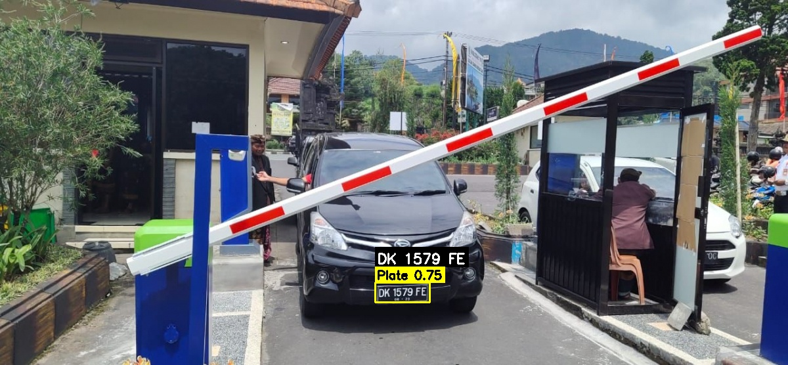

# 🚘 License Plate Recognition using YOLOv8 & Qwen-VL

## 📖 Introduction
This project implements an offline **License Plate Recognition (LPR)** system using stored images and video files. It combines the speed and accuracy of **YOLOv8m** for detecting license plate regions with the powerful **Qwen-VL 2.5/3B** vision-language model for OCR (Optical Character Recognition). The pipeline is optimized for extracting Indonesian vehicle plate numbers with high precision from various input formats.

---

## 🔧 Key Features
- 🖼️ **Input**: Static images or pre-recorded videos (no live streaming)
- 🎯 **Detection**: License plates are detected using **YOLOv8m (medium)** — balancing speed and accuracy
- 🔠 **OCR**: Plate regions are processed using **Qwen-VL 2.5/3B** for character recognition
- 🇮🇩 Optimized for **Indonesian plate formats** (e.g. `B 1234 XYZ`)
- 📝 Outputs include annotated images and extracted plate numbers in a log file
- 💻 Fully local processing (with optional use of cloud API for Qwen-VL inference)
- 📦 Modular design: detection, cropping, OCR, and logging are separated for flexibility

---

## 🧠 Model Pipeline

| Stage     | Model             | Function                         |
|-----------|------------------|----------------------------------|
| Detection | YOLOv8m          | Detect license plate bounding boxes |
| Cropping  | OpenCV           | Crop plate regions from images   |
| OCR       | Qwen-VL 2.5 / 3B | Recognize text from plate images |

---

## Results with YOLOv8m + Qwen-VL OCR
## 🖼️ Image Result  
Shows the detected license plates and OCR output overlaid on static input images.



> this image shows a correctly recognized **Indonesian license plate** using Qwen-VL OCR.
### VLM Prompt for Qwen-VL (Indonesian License Plate Reader)

```python
msgs = [
    {"role": "system", "content": "You are an Indonesian license plate reader"},
    {
        "role": "user",
        "content": [
            {"type": "image", "image": plate_pil},
            {"type": "text", "text": "Only output the license plate number. Do not include extra words. Do not read the date under the plate number."}
        ]
    }
]
```
---
## 🎞️ Video Result (Additional)
Processes pre-recorded video files, detecting license plates frame-by-frame and recognizing the plate numbers in sequence.


> ⚠️ Due to the heavy load of Qwen-VL 3B, **processing a 1-minute 30 FPS video can take nearly 1 hour**, making it less suitable for high-speed video OCR without frame skipping or optimization.


