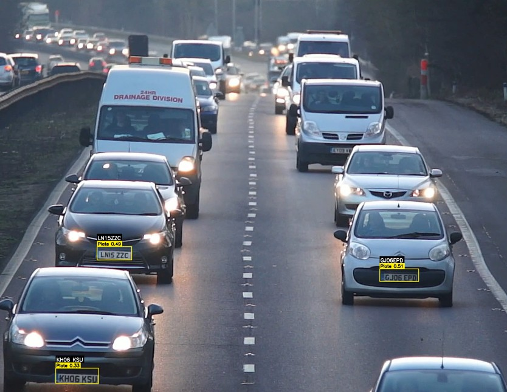

# Near Real-Time Vehicle Detection from Jakarta’s Traffic CCTVs
## 📖 Introduction
This project uses the smallest YOLOv8 model to perform real-time vehicle detection on live public CCTV feeds across Jakarta. The model is lightweight, enabling fast predictions even on modest hardware. Although the accuracy may vary due to the trade-off for speed, the system shows strong potential for efficient and scalable traffic surveillance. 
## 🔧 Key Features: 
- 🔴 Live streaming from public .m3u8 CCTV feeds (e.g. Bendungan Hilir, Gelora, Tomang, Jati Pulo) 
- 🎯 Detection focused on car, motorcycle, bus, and truck 
- 🧠 Model: YOLOv8n (nano) pretrained on COCO dataset 
- 📊 Real-time vehicle counting and traffic status classification (No Traffic, Less Traffic, Crowded) 
- 🌐 Simple Flask-based web interface with camera switching 
- 🕒 Live timestamp overlay 
- 💻 All processing runs locally (on your own device) 
- 🌍 Public Access with Cloudflared: 
To allow others to view the real-time detection system without exposing your local IP or setting up a server, the app uses Cloudflared Tunnel. This makes the Flask app temporarily available over the internet via a secure trycloudflare.com link — perfect for sharing quick demos or remote testing. 
- 📈 Line chart of vehicle per-minute 
## 🧠 Results with YOLOv8nano

This project uses the smallest YOLOv8 model to enable near real-time predictions. While the detections may not always be perfect due to the lightweight nature of the model especially on low-light condition, it demonstrates strong potential for efficient and scalable traffic monitoring solutions.
